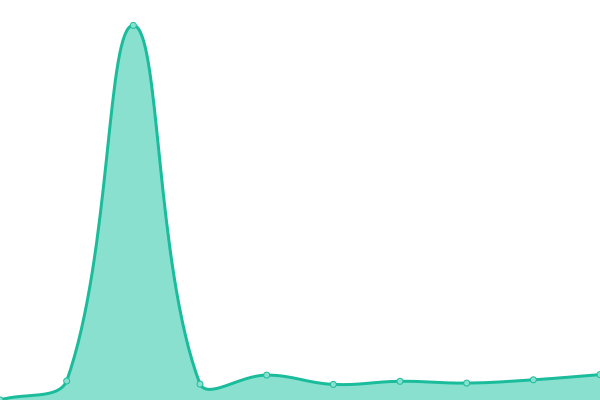

# [📈 Live Status](https://feebyapp.github.io/status): <!--live status--> **🟧 Partial outage**

This repository contains the open-source uptime monitor and status page for [Feeby](https://feeby.app), powered by [Upptime](https://github.com/upptime/upptime).

With [Upptime](https://upptime.js.org), you can get your own unlimited and free uptime monitor and status page, powered entirely by a GitHub repository. We use [Issues](https://github.com/feebyapp/status/issues) as incident reports, [Actions](https://github.com/feebyapp/status/actions) as uptime monitors, and [Pages](https://feebyapp.github.io/status) for the status page.

<!--start: status pages-->
<!-- This summary is generated by Upptime (https://github.com/upptime/upptime) -->
<!-- Do not edit this manually, your changes will be overwritten -->
<!-- prettier-ignore -->
| URL | Status | History | Response Time | Uptime |
| --- | ------ | ------- | ------------- | ------ |
|  [Public Web](https://www.feeby.app) | 🟩 Up | [public-web.yml](https://github.com/feebyapp/status/commits/HEAD/history/public-web.yml) | 

 943ms
     
 | 

<a href="https://www.feebystatus.com/history/public-web">100.00%</a>
    

|  Dashboard | 🟩 Up | [dashboard.yml](https://github.com/feebyapp/status/commits/HEAD/history/dashboard.yml) | 

 502ms
     
 | 

<a href="https://www.feebystatus.com/history/dashboard">100.00%</a>
    

|  Email Service | 🟥 Down | [email-service.yml](https://github.com/feebyapp/status/commits/HEAD/history/email-service.yml) | 

 342ms
     
 | 

<a href="https://www.feebystatus.com/history/email-service">99.85%</a>
    

|  Identicon Service | 🟩 Up | [identicon-service.yml](https://github.com/feebyapp/status/commits/HEAD/history/identicon-service.yml) | 

 153ms
     
 | 

<a href="https://www.feebystatus.com/history/identicon-service">100.00%</a>
    

|  Island CDN | 🟩 Up | [island-cdn.yml](https://github.com/feebyapp/status/commits/HEAD/history/island-cdn.yml) | 

 185ms
     
 | 

<a href="https://www.feebystatus.com/history/island-cdn">100.00%</a>
    

<!--end: status pages-->
